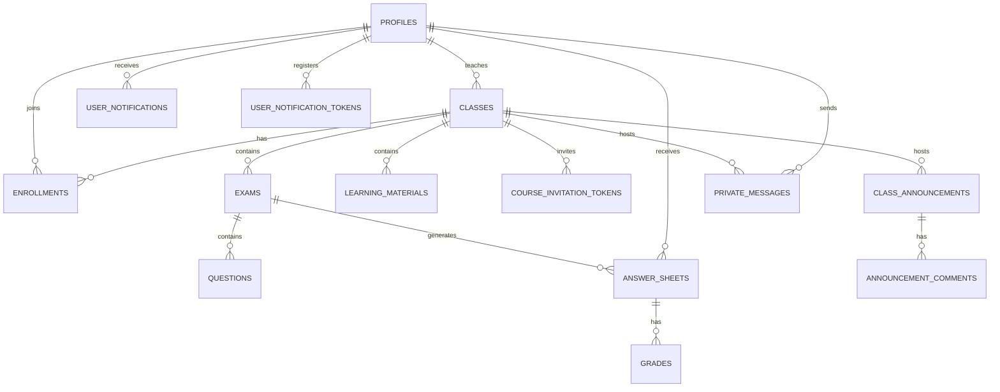

# CheckMate database schema alignment

Older deployments had a separate `answers` table and no course announcement
tables. The current app saves each locally graded sheet's item evaluations in
`grades.answers` and never reads or writes the separate `answers` table. The
current screenshots already show item results, personal feedback, course
messages, invitations, and notification tables. The UML class diagram places `StreamPost`
and `ClassComment` under a course, separate from assessments. The business rules
still require the item evaluations for review, topic analysis, and each
student's released result (BR-08 through BR-12).

The target relationships are:



`grades.answers` is a JSONB snapshot of item order, question/key, selected
answer, confidence, and deterministic correctness from each confirmed phone
scan. Automatic per-sheet sync keeps the item breakdown under the same release and ownership
policy as the score. A separate `answers` table would duplicate those data.
The UML's `StreamPost` is a broader UI model: actual course files remain in
`learning_materials`, while `class_announcements` stores instructor messages
and the per-message comment setting. The old attachment button only invented
a filename, so the database does not claim to store announcement files.
`answer_sheets` remains essential: its unique printed Sheet ID identifies the
student and assessment before local OMR processing (BR-04/05). `questions`
remains the instructor's answer key. `grades.student_insight` stores personal
feedback under the grade release gate. Class analysis is computed from saved
grades through FastAPI. The unused `ai_insights` table is retired by the guarded
cleanup migration. Course roles come from `classes.instructor_id` and
`enrollments.role`; the redundant account-level `profiles.role` is also removed.
See `DATABASE_CLEANUP.md` for the exact removals and deployment order.

For the existing Supabase project, run these scripts in the SQL Editor in order:

**Do not start with `supabase_retire_legacy_answers.sql`.** It permanently
removes the old table and requires `grades.answers`, which step 1 creates.

1. `supabase_result_details.sql` adds item results and feedback to `grades`,
   installs the transactional session-save function, and copies legacy
   `answers` rows into empty grade snapshots.
2. `supabase_announcements.sql` creates the separate announcement/comment
   tables and their instructor/member policies.
3. `supabase_core_access.sql` restricts question keys and any remaining legacy
   AI-insight records. It tolerates an absent `ai_insights` table after cleanup.
   Current personal feedback uses the grade's release/ownership policy. It also blocks app
   clients from reading the unused legacy `answers` table while it remains.
   The script stops if it finds an unreviewed policy that might still expose
   question keys or insights.
4. `supabase_enrollments_select.sql` adds a SELECT policy to enrollments so that
   students can view the list of their classmates, fixing the issue where they
   could only see themselves.
5. `supabase_notifications.sql` adds per-student/instructor direct messages,
   an in-app notification inbox, and database triggers for new announcements,
   direct messages, uploaded learning materials, and results released after a saved grade. It creates the
   announcement/comment tables and policies itself when step 2 was skipped,
   so it can be run alone on an existing core schema and safely rerun after a
   failed attempt. It also enables Supabase Realtime for the two new tables.
   Existing device-only chat
   history cannot be transferred to other users because it was never saved in
   the shared database. New messages are stored per course and student. The
   inbox, unread badge, and foreground local alerts update through Supabase
   Realtime while the app is open; Android background push uses registered
   FCM devices and the notification INSERT webhook. See NOTIFICATIONS_SETUP.md
   for configuration. If only messages/announcements work on an existing
   installation, run supabase_notification_release_fix.sql to install the
   missing material/result triggers and update notification visibility.

These setup migrations are additive and can be reviewed independently.
`supabase_schema_cleanup.sql` is a separate, guarded removal step after the
updated backend/app are deployed. It preserves all retained records; see
`DATABASE_CLEANUP.md`. Before
retiring `answers`, inspect grades for older sheets: every answer row must be
represented in `grades.answers`. Legacy rows do not contain printed set order,
so their backfill deliberately omits `question_number`; old item display order
cannot be guaranteed for multiple-set assessments. A legacy answer with no
saved grade remains in `answers` and blocks retirement.

Private course invitation links contain random, single-purpose tokens instead
of the manual course code. Tokens expire after seven days; resetting a course
code revokes all outstanding tokens. The raw course code is readable only via
an owner-checked RPC, and students join manually with a code through a separate
protected RPC. Direct client reads of `classes.code` and direct enrollment
inserts are revoked. Old code-bearing web invitation links are invalidated.

For an existing project, run `supabase_private_course_invites.sql` in the
Supabase SQL Editor before deploying the updated app or backend. It replaces
the old expiry-on-course-code behavior; existing manual course codes remain
usable, while existing code-based web links stop working.

For a fresh project, run `supabase_schema.sql`, `supabase_result_details.sql`,
`supabase_notifications.sql`, and `supabase_private_course_invites.sql`.
The result-detail migration installs the save RPC; notifications install the
inbox, device tokens and event triggers. The last script installs the private token
table, owner-only code RPCs, protected manual/token enrollment RPCs, and the
column/table permission changes required by the app.

Confirm step 1 completed before checking or retiring legacy rows:

```sql
SELECT column_name, data_type
FROM information_schema.columns
WHERE table_schema = 'public' AND table_name = 'grades'
  AND column_name IN ('answers', 'student_insight')
ORDER BY column_name;
```

It should return `answers` as `jsonb` and `student_insight` as `jsonb`.

`supabase_retire_legacy_answers.sql` is a separate final step. It checks every
legacy row against the saved JSONB item by sheet, question, selected answer,
and correctness. If anything is missing or another database object depends on
the table, the transaction aborts. Back up the production database and inspect
the old result breakdown before running this permanent table removal.

After step 1, this read-only query lists rows that would block retirement:

```sql
SELECT a.id, a.sheet_id, a.question_id
FROM public.answers a
WHERE NOT EXISTS (
  SELECT 1
  FROM public.grades g
  CROSS JOIN LATERAL jsonb_array_elements(g.answers) AS item(value)
  WHERE g.sheet_id = a.sheet_id
    AND (item.value->>'question_id') = a.question_id::text
    AND (item.value->>'answer') IS NOT DISTINCT FROM a.selected_answer
    AND (item.value->>'isCorrect')::boolean IS NOT DISTINCT FROM a.is_correct
)
LIMIT 50;
```

An empty result means the row-level preservation check passes. It does not
verify printed question order, which the legacy table did not store.

`supabase_schema.sql` is only for a fresh database. Its accidental data-wiping
block has been removed, and its table definitions now include `grades.answers`,
announcements, comments, and their access policies. Do not rerun that full
schema script on the existing production project. After fresh setup, run
`supabase_result_details.sql` once to install the session-save function; its
table changes and the legacy backfill are harmless when there is no old data.
